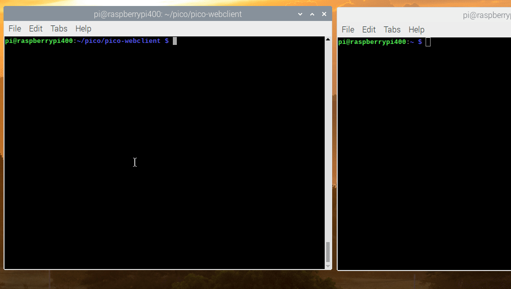
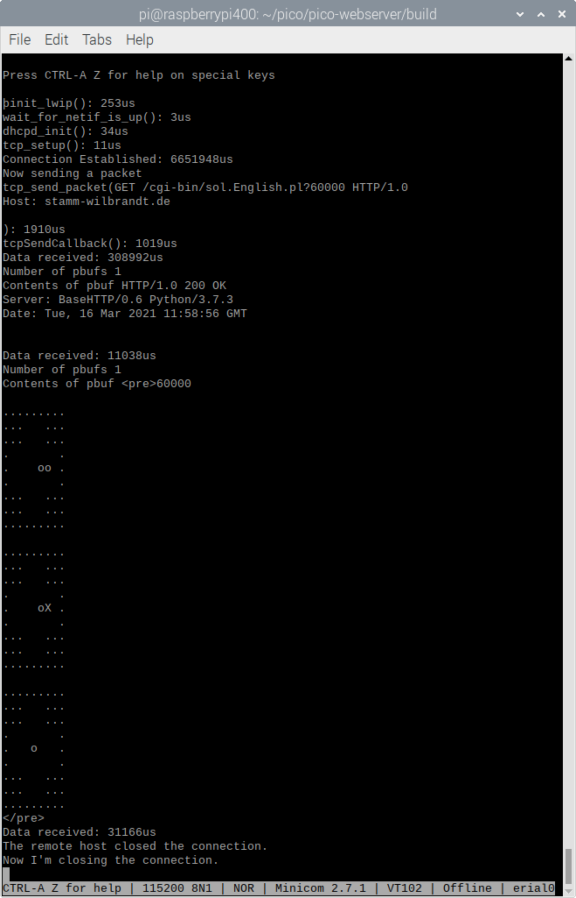

# pico-webclient

This repo is based on [pico-webserver](https://github.com/maxnet/pico-webserver) webserver, which is example that came with TinyUSB slightly modified to run on a Raspberry Pi Pico.  
Lets the Pico pretend to be a USB Ethernet device (192.168.7.1), the computer the Pico is connected to over USB is 192.168.7.2. For me that is a Pi400, replace Pi400 with whatever computer you connect your Pico to.  
The basic lwip based webclient functionality was taken from this posting, corrections and modifications done based on that:  
[Re: How can I send a simple HTTP request with a lwIP stack?](https://stackoverflow.com/a/28105889)  
There is a forum thread associated with development of this repo:  
[Pico webclient over USB example](https://www.raspberrypi.org/forums/viewtopic.php?f=145&t=306953)


# Build dependencies

On Debian:

```
sudo apt install git build-essential cmake gcc-arm-none-eabi
```

Your Linux distribution does need to provide a recent CMake (3.13+).
If not, compile [CMake from source](https://cmake.org/download/#latest) first.

## Build instructions

```
git clone --depth 1 https://github.com/Hermann-SW/pico-webclient
cd pico-webclient
git submodule update --init --depth 1
mkdir -p build
cd build
cmake ..
make
```

Parallel build on 4 cores of Pi400 does take 13 seconds only to build from scratch or after "make clean"

```
pi@raspberrypi400:~/pico/pico-webclient/build $ time (make -j4 2>err >out)

real	0m12.747s
user	0m33.585s
sys	0m10.965s
pi@raspberrypi400:~/pico/pico-webclient/build $ 
```

Copy the resulting pico_webclient.uf2 file to the Pico mass storage device manually.  

By default (SCENARIO=1 in CMakeLists.txt) Pico is accessing index.html on Pi400 webserver. In case you have no webserver running, you can start a simple one:
```
sudo ./do_get.py
```
This is simple demonstration for SCENARIO=1:  



Building with SCENARIO=2 in CMakeLists.txt does HTTPS GET request for /cgi-bin/sol.English.pl?60000 against stamm-wilbrandt.de. lwip as configured here cannot do HTTPS, so request goes through http2https.py proxy listening on port 4433 on 192.168.7.2, started with this command on the Pi400:
```
./http2https
```

Building with SCENARIO=3 in CMakeLists.txt needs NAT configured on the Pi400 for the Pico being able to access the internet. Pico does HTTP GET for index.html against neverssl.com. Replace "wlan0" with "etho" in case Pi400 is connected via ethernet and not Wifi.
```
echo 1 | sudo tee /proc/sys/net/ipv4/ip_forward
sudo apt install nftables
sudo nft add table nat
sudo nft 'add chain nat postrouting { type nat hook postrouting priority 100 ; }'
sudo nft add rule nat postrouting oif wlan0 masquerade
```


While serial connection from Pi400 to Pico is not required for the demos, you need it in case you want to see the output of pico-webclient.  

Pico LED starts on and goes off on successful receipt of response. In case of an error, endless blinking loop gets entered. So you can "see" whether HTTP[S] GET request succeeded, failed or even hangs (LED keeps on).

This is minicom example session for scenario 2. You can reexecute by simply unplugging the USB cable and reconnecting it:  

